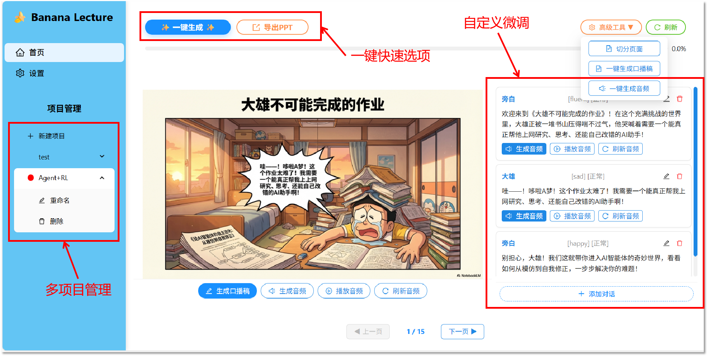
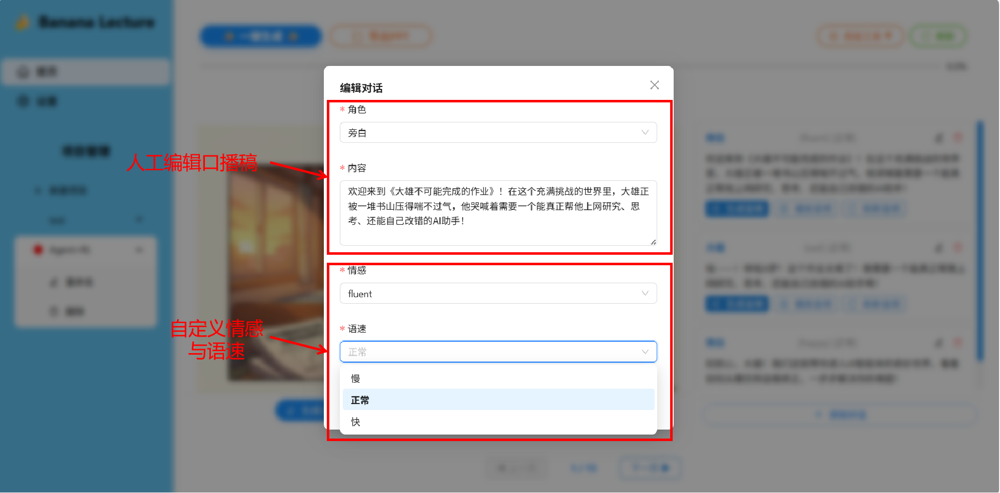

<div align="center">

<!-- omit in toc -->

# 🍌 BananaLecture 🎙️


*将静态PPT转换为动态有声Lecture,让课堂更有趣*

[](https://github.com/ChengJiale150/BananaLecture)
[](https://hub.docker.com/r/chengjiale150/bananalecture)
[](https://opensource.org/licenses/MIT)

*如果该项目对你有用, 欢迎star🌟 &  fork🍴*

</div>

## 📖 目录

- [项目缘起](#-项目缘起)
- [结果案例](#-结果案例)
- [功能介绍](#-功能介绍)
- [快速开始](#-快速开始)
- [故障排除](#-故障排除)
- [贡献指南](#-贡献指南)
- [许可证](#-许可证)


## ✨ 项目缘起
你是否也曾陷入这样的教学困境：课堂上学生抬头率低，静态PPT乏味枯燥，学生注意力难以维持；教师单向输出，缺乏互动机制，教学效果大打折扣？

传统的教学辅助工具虽然能解决部分问题，但还存在以下核心缺陷：

- 1️⃣伪交互：无法实现逼真的多角色对话，沉浸感弱
- 2️⃣不可控：生成即定型，不支持人工微调，无法满足教学严谨性需求
- 3️⃣同质化：成品体验相似，缺乏个性化教学场景适配
- 4️⃣黑盒化：无法干预生成过程，教学内容准确性难以保障

以上这些缺陷，让传统工具难以真正解决课堂互动的痛点。我们需要一个兼具“技术成熟度”与“场景可控性”的方案，才能真正打通教学最后一公里。

### 🚀 核心优势

- 🎭 **多角色对话**：支持多个角色之间的自然对话，增强互动性
- 🔊 **沉浸式音效**：模拟真实音效，提升学习沉浸感
- 🎛️ **高可控微调**：可人工微调生成内容，满足个性化教学需求

### 👨‍🏫 适用场景

1. **教师**：将静态PPT转化为有声讲座，提升课堂互动性和学生参与度
2. **教育机构**：批量生成标准化有声课程，降低课程制作成本
3. **学生**：制作有声学习材料，提升学习效率和记忆效果
4. **培训师**：打造交互式培训课程，增强培训效果
5. **内容创作者**：生成有声教学内容，拓展知识传播渠道

## 🎨 结果案例

<div align="center">
  
</div>


<div align="center">
  <audio controls="controls" style="width: 600px;">
    <source type="audio/mpeg" src="https://raw.githubusercontent.com/ChengJiale150/BananaLecture-example/main/example/example.mp3">
    Your browser does not support the audio element.
  </audio>
</div>

更多结果案例请参阅[**BananaLecture-example**](https://github.com/ChengJiale150/BananaLecture-example)项目。


## 🎯 功能介绍

### 方便快捷的一键生成
- **一键生成**: 一键完成拆分页面->生成口播稿->生成音频全流程，并导出PPT
- **分阶段逐步生成**: 支持用户分阶段进行操作，灵活定制生成过程
- **可视化进度**: 提供可视化进度条，方便用户跟踪生成进度

<div align="center">
  
</div>

### 高度可控的微调配置
- **页面口播稿**: 支持用户自定义每个页面的口播内容
- **角色对话**: 可配置不同角色的对话内容，丰富互动效果
- **音频参数**: 支持调整音频参数，如情感、语速等

<div align="center">
  
</div>

## 🏁 快速开始

1. **拉取项目代码**

```bash
git clone https://github.com/ChengJiale150/BananaLecture.git
cd BananaLecture
```

2. **配置环境变量**

```bash
cp .env.example .env
```

从[Openrouter](https://openrouter.ai/)获取LLM API密钥并配置到`.env`文件中。
从[MiniMax](https://platform.minimaxi.com/)获取语音合成API密钥与Group id并配置到`.env`文件中。

3. **克隆角色音色**

> [!TIP]
> 该步骤可以省略(哆啦A梦与大雄的音色将使用默认男女音色)
> 克隆独属你的哆啦A梦与大雄音频以获取最佳效果

<details>
<summary><b>具体克隆流程</b></summary>

分别截取10秒以上哆啦A梦与大雄的纯净音频，在[Minmax音频克隆实验台](https://platform.minimaxi.com/examination-center/voice-experience-center/voiceCloning)上传克隆音频,并获取克隆音色的voice id。

在[config.yaml](config.yaml)中配置对应角色的voice id。

```yaml
大雄: "大雄的voice id"
哆啦A梦: "哆啦A梦的voice id"
```

</details>


4. **Docker一键启动**

安装[🐳 Docker](https://www.docker.com/),使用docker-compose在<u>项目目录下</u>一键启动项目。

```bash
docker-compose up -d
```

成功启动后,应该会看到以下输出:

```
[+] Running 2/2
 ✔ Network bananalecture_default  Creat...            0.1s 
 ✔ Container bananalecture        Started             1.0s 
```

访问[http://localhost:3574](http://localhost:3574)即可打开前端页面,访问[http://localhost:8000/docs](http://localhost:8000/docs)即可打开后端API文档。

5. **初步测试**

在[NotebookLM](https://notebooklm.google.com/)中新建一个Notebook,上传你的资料,生成一个PPT,可以使用如下提示词:

```
Create a comic in the style of Doraemon manga, depicting Doraemon teaching Nobita the core content of this document, with Chinese dialogue, in color. The comic will be used in a undergraduate class.
```

成功生成后,将生成的PDF上传到前端页面,点击"一键生成"就可以了,祝你玩的开心！

## 🐛 故障排除

### 📚 常见问题

1. **脚本生成失败**
   
   - 检查OpenAI API密钥是否正确
   - 检查服务供应商是否提供tool_choice参数(要求为"required")
   - 确认网络连接正常

2. **音频生成失败**
   
   - 检查MiniMax API密钥和组ID是否正确
   - 确认账户余额充足

3. **PPT导出失败**
   
   - 确认项目已完成处理
   - 确认项目名称为英文或数字组合(不支持中文)

## 🤝 贡献指南

我们欢迎各种形式的贡献！
有关如何开始开发并提交贡献的详细说明，请参阅我们的[**贡献指南**](CONTRIBUTING.md)。

## 📄 许可证

本项目基于MIT许可证开源，您可以在遵守许可证条款的前提下自由使用、修改和分发本项目的代码。

有关详细信息，请参阅[**LICENSE**](LICENSE)文件。

<div align="center">

**如果这个项目对您有帮助，请给我们一个 ⭐️**

Made with ❤️ by [ChengJiale](https://github.com/ChengJiale150)

</div>
